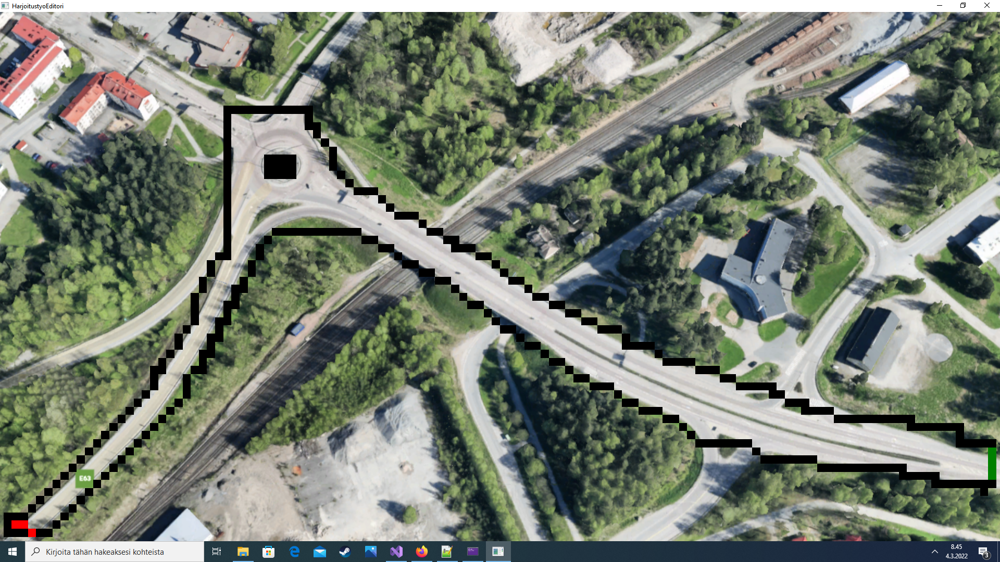

# Kenttä editori

## Tietoja 

Tekijä: Eemil Kauppinen

Pelialusta: Windows

Pelaajien lukumäärä: 1

## Kenttäeditorin tila tällä hetkellä

Kenttäeditoriin voi ottaa minkä tahnsa kuvan ja sen päälle rakentaa kentän. Kun painat hiirtä ruudulle
ilmestyy musta neliö, joka on oikeasti pelissä pallo. Musta neliö toimii reuna palikkana. Kun painat hiirtä uudestaan
musta neliö muuttuu punaiseksi eli aloitus paikaksi ( ei toimi vielä ). Kun painat hiirtä uudestaan sen jälkeen pallo muuttuu vihreäksi eli lopetus pisteeksi.
Kun painat hiirtä uudestaan syntyy uudestaan näkymätön objekti.

## Näppäimet

* `s` Tallenna. (tallentaa nyt tiedostoon kentta1.txt). Peli lataa saman tiedoston.
* `l` Lataa. (lataa tiedoston kentta1.txt)

## Hahmotelma pelistä

## Jatkosuunnitelma suunnitelma

Aloitus palikka pitäisi saada tehtyä ja impulssi pallot, jotka tökkivät palloja eteenpäin, muuten kenttäeditori on valmis. Lisää kenttiä on luvassa.