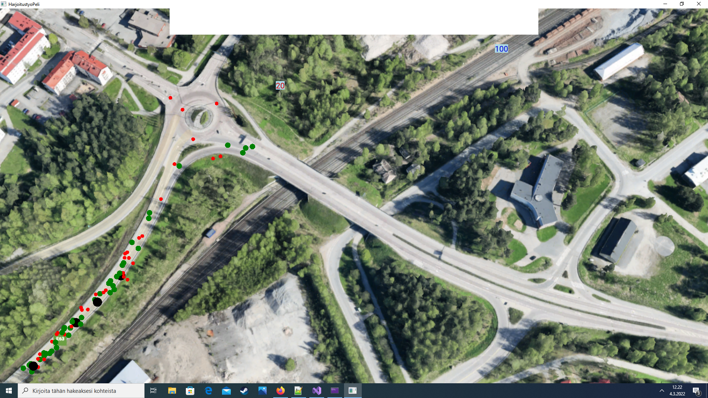

# Peli

## Tietoja 

Tekijä: Eemil Kauppinen

Pelin nimi: En ole vielä keksinyt

Pelialusta: Windows

Pelaajien lukumäärä: 1

## Pelin tarina

Örkit (pallot) hyökkäävät tukikohtaan reittiä pitkin. Aseta tykkejä jotka tuhoavat örkkejä.

## Pelin tämän hetkinen tilanne

Pallo kulkevat rataa pitkin onnistuneesti, laskurit ovat lisätty. 
Vihollisia on monenlaisia eri raha ja elämä arvoisia.
Kun pallo menee vihreälle alueelle se tuhoutuu ja elämä laskurista lähtee piste pois.
Pallot pysähtvät kun laskuri menee nolliin.

## Näppäimet

Hiirtä klikattaessa pallo tuhoutuu ja rahaa tulee lisää vihollisen arvon mukaan.

## Hahmotelma pelistä

## Jatkosuunnitelma suunnitelma

Tykit pitäisi lisätä, tykkien ja laskurien valikko ylhäällä on kesken. Sekä pallojen jatkuva tasaisesti nouseva generointi.
