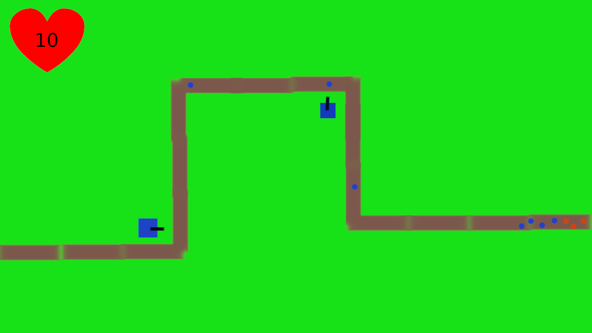

# Harjoitustyön suunnitelma

## Tietoja 

Tekijä: Eemil Kauppinen

Työ git-varaston osoite: <https://github.com/EemilKauppinen/Ohjelmointi1>

Pelin nimi: En ole vielä keksinyt

Pelialusta: Windows

Pelaajien lukumäärä: 1

## Pelin tarina

Örkit (pallot) hyökkäävät tukikohtaan reittiä pitkin. Aseta tykkejä jotka tuhoavat örkkejä.

## Pelin idea ja tavoitteet

Kyseessä on tower-defense peli jossa on kenttä jossa liikkuu palloja rataa pitkin. Palloja päästää läpi jos pääsee läpi se oli siinä. Rahalla voi ostaa tykkejä jotka ampuvat palloja.

Kun kaikki pallot on tuhottu peli päättyy.

## Hahmotelma pelistä

## Toteutuksen suunnitelma

Helmikuu

- Teen ensimmäisen tykin
- Teen kentän ekan version
- Teen yhden vihun

Maaliskuu

- Teen loput vihut
- Palloille impulssi eli liike
- Lopetus / Pallojen tuhoutuminen

Jos aikaa jää

- Lisää kenttiä
- Erillaisia tykkejä ja palloja
- Kenttien parantelua
